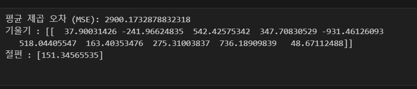
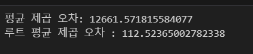
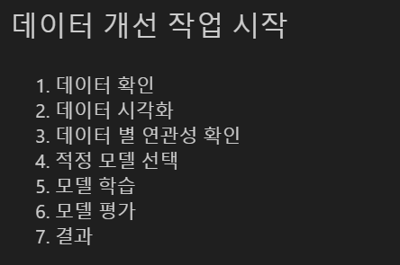
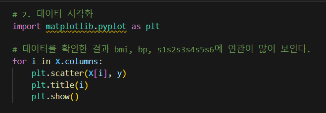
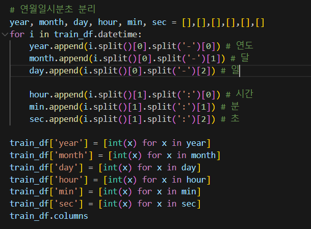
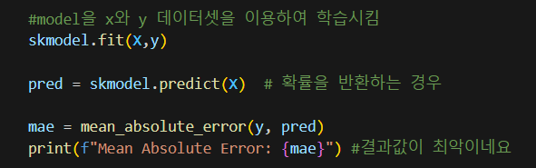

# AIFFEL Campus Online Code Peer Review Templete
- 코더 : 김강우
- 리뷰어 : 손병진

# PRT(Peer Review Template)
- [x]  **1. 주어진 문제를 해결하는 완성된 코드가 제출되었나요?**
    - 문제에서 요구하는 최종 결과물이 첨부되었는지 확인
        - 프로젝트 1 : MSE 손실함수값 3000 이하를 달성
        

        - 프로젝트 2 : RMSE 값 150 이하를 달성
        

    
- [x]  **2. 전체 코드에서 가장 핵심적이거나 가장 복잡하고 이해하기 어려운 부분에 작성된 
주석 또는 doc string을 보고 해당 코드가 잘 이해되었나요?**
    - 프로세스 정리
    : 단계별로 프로세스를 정리하여 코드 이해가 쉬움.
    
    - 시각화
    : 모든 변수에 대해서 시각화로 데이터 분포를 살펴보고 꼼꼼함이 돋보임
    
    - 파생변수 추출
    : 색다른 형식으로 년월일시간을 분리해서 인상깊음
    
    - 
        
- [x]  **3. 에러가 난 부분을 디버깅하여 문제를 해결한 기록을 남겼거나
새로운 시도 또는 추가 실험을 수행해봤나요?**
    - 다양한 모델학습 시도
    : 하나의 모델만 돌린게 아니라 여러 모델을 활용하여 원하는 결과를 얻기위해 다양한 시도를 함.
    - 주석활용
    : 코드나 베이스라인 설계에 관한 이유를 주석으로 적어 이해가 쉬움.
    
        
